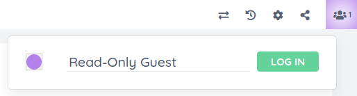

 

# ep\_guest



Etherpad plugin that grants limited access to users that are not logged in via
another authentication plugin such as
[ep\_openid\_connect](https://www.npmjs.com/package/ep_openid_connect).

When a user first visits Etherpad, they will be "authenticated" as a guest user
that does not have permission to create or modify pads. A "log in" button in the
user drop-down list forces the user to authenticate via Etherpad's built-in HTTP
basic authentication or via an authentication plugin (if one is installed).
After logging in, the "log in" button becomes a "log out" button.

This is a fork of
[ep\_readonly\_guest](https://github.com/ether/ep_readonly_guest) that allows
admins to relax the read-only restriction.

## Configuration

Example:

```json
  "requireAuthentication": true,
  "ep_guest": {
    "username": "guest"
  },
  "users": {
    "guest": {
      "displayname": "Read-Only Guest",
      "readOnly": true
    }
  },
```

Detailed description:

  * `requireAuthentication`: Must be explicitly set to `true` to enable this
    plugin.
  * `ep_guest.username` (optional, defaults to `"guest"`): The username used for
    the guest account. The corresponding object in the `users` setting (see
    below) contains settings for the guest account.
  * `users[ep_guest.username]` (optional, defaults to `{}`): Object in `users`
    that holds settings for the guest account. Relevant properties:
      * `displayname` (optional, defaults to "Read-Only Guest"): The name that
        appears in the user drop-down list for guest users. Guests are unable to
        change the name unless this is set to `null`.
      * `readOnly` (optional, defaults to `true`): Whether the guest user can
        only read existing pads. If `true`, `canCreate` is ignored.
      * `canCreate` (optional, defaults to `true`): Whether the guest user can
        create new pads. Ignored if `readOnly` is `true`.

## Copyright and License

Copyright © 2022 the ep\_guest authors and contributors\
Copyright © 2020–2022 the ep\_reaonly\_guest authors and contributors

Licensed under the [Apache License, Version 2.0](LICENSE) (the "License"); you
may not use this file except in compliance with the License. You may obtain a
copy of the License at

http://www.apache.org/licenses/LICENSE-2.0

Unless required by applicable law or agreed to in writing, software distributed
under the License is distributed on an "AS IS" BASIS, WITHOUT WARRANTIES OR
CONDITIONS OF ANY KIND, either express or implied. See the License for the
specific language governing permissions and limitations under the License.
